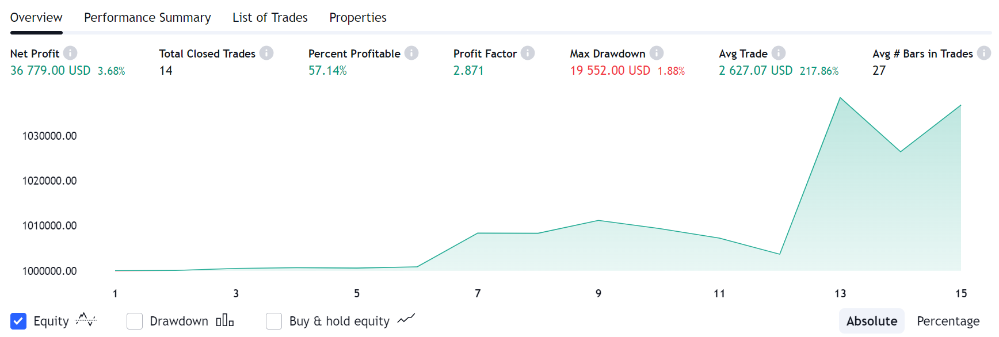

# Bitcoin-Quantitative-Trading-Strategy
This strategy is a modification of the classic Bollinger Bands strategy and works quite well on the back-testing. I coded this strategy for a trader using Pine Script in January 2023. It seems an unaggressive and steady strategy.

## Thank You!
Please ⭐ this repo if you think this is helpful.

## Screenshots

## Requirements 
* Pine Script 5.0

## How to use
Run the codes from Modified_BB_Strategy file in Pine Script v5 Compiler.

## Contributing 💡
Looking forward to any feedback!
